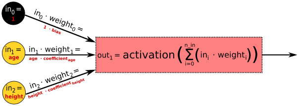

:stem: latexmath
= Neural Networks explained with high school mathematics

The best way to learn about ideas is to learn how those ideas emerged in the first place. So where do neural networks come from ? To answer this question, out journey will start by defining a simple linear model. From there on, by refining the idea and adding complexity to it, we will get what we call a feed-forward neural network. Understanding how it works with all the math behind their functioning will enable us to understand more complex types of networks later.

I will show the mathematical details of our operations in a way that I hope is understandable to people who stopped doing math in high school. After reading it, you will have a grasp of matrices operations, how and why it applies to neural networks.

== Building a simple neural network

Let's say we want to build a model that predicts people's *salary* given only their *age* and *height*.

We want this model to be extra simple, so we'll restrict the possibilities to a linear combination of the inputs, namely *age* and *height*. You probably remember that the formula of a line is latexmath:[y(x) = a \cdot x + b] ? Our model's formula will look like this :

[latexmath]
++++
salary(\color{blue}{age}, \color{green}{height}) = \color{blue}{coefficient_{age}} \cdot \color{blue}{age} + \color{green}{coefficient_{height}} \cdot \color{green}{height}\color{black} + bias
++++

The latexmath:[bias] term has the same function as the latexmath:[b] term present in the equation of a line.

Our whole model will be determined by, and only by the following parameters :

[latexmath]
++++
(\color{blue}{coefficient_{age}}, \color{green}{coefficient_{height}}\color{black}, bias)
++++

We say that our model has *three parameters*. Those will respectively represent :

* latexmath:[\color{blue}{coefficient_{age}}] : How the *age* contributes to the *salary*
* latexmath:[\color{green}{coefficient_{height}}] : How the *height* contributes to the *salary*
* latexmath:[bias] : How all of this is adjusted. Think of what have to be the result of latexmath:[salary(0, 0)] for our model to be a good approximation of reality

Here is a graphic representing what such model looks like. The parameters here are latexmath:[(\color{blue}{1.5}, \color{green}{1.1}\color{black}, 50)] :

[gnuplot, sigmoid, png, title=A visual example for salary = age * 1.5 + height * 1.1 + 50, align="center"]
....
set grid nopolar
set grid xtics nomxtics ytics nomytics noztics nomztics nortics nomrtics \
 nox2tics nomx2tics noy2tics nomy2tics nocbtics nomcbtics
set grid layerdefault lt 0 linecolor 0 linewidth 0.500, lt 0 linecolor 0 linewidth 0.500
set samples 50, 50
set isosamples 30, 30
set style data lines
set title "Example : salary = age * 1.5 + height * 1.1 + 50"
set xlabel "Age"
set xlabel  offset character -3, -2, 0 font "" textcolor lt -1 norotate
set xrange [ 0 : 80 ] noreverse nowriteback
set x2range [ * : * ] noreverse writeback
set ylabel "Height"
set ylabel  offset character 3, -2, 0 font "" textcolor lt -1 rotate
set yrange [ 0 : 120 ] noreverse nowriteback
set y2range [ * : * ] noreverse writeback
set zlabel "Salary"
set zlabel  offset character 0, 0, 0 font "" textcolor lt -1 norotate
set zrange [ * : * ] noreverse writeback
set cbrange [ * : * ] noreverse writeback
set rrange [ * : * ] noreverse writeback
set pm3d
set palette

splot x * 1.5 + y * 1.1 + 50 notitle
....

At this point you might wonder.

Ok sure that's great but how does this relate to a neural network ? Those are supposed to be difficult and this looks way too easy.

In fact what we defined can already be modelized by a very simple neural network consisting of two input nodes, *age* and *height*, and one output node, the predicted *salary*. Here's a visual representation of it :

[graphviz, simple_ffnn, png, alt="Simple Feed-Forward Neural Network", align="center", title="A very simple Feed-Forward Neural Network"]
....
digraph SimplestFFNN {
    rankdir = LR;
    splines=false;
    edge[style=invis];
    ranksep= 1.4;
    {
        node [shape=circle, color=black, style=filled, fillcolor=black, fontcolor=white, fixedsize=true, width=0.7, height=0.7];

        in0 [label=<in0=1>];
    }
    {
        node [shape=circle, color=black, style=filled, fillcolor=yellow, fixedsize=true, width=0.7, height=0.7];

        in1 [label=<in1= age>];
        in2 [label=<in2= height>];
    }
    {
        node [shape=circle, color=black, style=filled, fillcolor=orangered, fixedsize=true, width=0.7, height=0.7];

        out1 [label=<out1= salary>];
    }
    {
        rank=same;
        in0->in1->in2;
    }
    {
        rank=same;
        out1;
    }
    l0 [shape=plaintext, label="Input layer"];
    l0->in0;
    {
        rank=same;
        l0;
        in0;
    }

    l2 [shape=plaintext, label="Output layer"];
    l2->out1;
    {
        rank=same;
        l2;
        out1;
    }

    edge[style=solid, tailport=e, arrowsize=0.6];

    in0 -> out1
    in1 -> out1
    in2 -> out1
}
....

* *The input layer is what you feed into the neural network*, it could be an image, a book, a song, data from a company's sales department, etc.

* *The output layer is what the neural network predicts*. It could be a sum of money, the probabilities that an image contains a car or a tree, the probability that a piece of music is rock or pop music, etc.

* *The bias is modelized like any other parameter but with a value of latexmath:[1].*

* *The parameters are called weights.*

In the image above, the interesting things that are actually happening are hidden, let's see it in details :

We will discuss about the latexmath:[activation] function in a later article. For now we will take latexmath:[activation(x) = x], which means we can just ignore it. So what we get as output is :

[latexmath]
++++
out_{\color{red}{1}} = salary(\color{blue}{age}, \color{green}{height}\color{black})
++++
[latexmath]
++++
out_{\color{red}{1}} = activation(\color{red}{\sum_{i = 0}^{n\_in}}\color{black}(in_{\color{red}{i}}\color{black} \cdot weight_{\color{red}{i}}\color{black}))
++++
[latexmath]
++++
out_{\color{red}{1}} = \color{red}{\sum_{i = 0}^{n\_in}}\color{black}(in_{\color{red}{i}} \cdot weight_{\color{red}{i}})
++++
[latexmath]
++++
out_{\color{red}{1}} = 1 \cdot bias + \color{blue}{age \cdot coefficient_{age}} + \color{green}{height \cdot coefficient_{height}}
++++

Remember the formula we started with ?

[latexmath]
++++
salary(\color{blue}{age}, \color{green}{height}) = \color{blue}{coefficient_{age} \cdot age} + \color{green}{coefficient_{height} \cdot height}\color{black} + bias
++++

It's exactly the same ! The important things you should remember here is that :

IMPORTANT: The weights are the parameters of the network.

And :

IMPORTANT: The output of the model is called the prediction.

== A slighly more complex example

This is the neural network we will focus on in this section :

[graphviz, ffnn, png, alt="A Feed-Forward Neural Network with two hidden layer", title="A Feed-Forward Neural Network with two hidden layer" align="center"]
....
digraph FFNN {
    rankdir = LR;
    splines=false;
    edge[style=invis];
    ranksep= 1.4;
    {
        node [shape=circle, color=black, style=filled, fillcolor=black, fontcolor=white, fixedsize=true, width=0.7, height=0.7];

        in0 [label=<in0>];
        h10 [label=<h1,0>];
        h20 [label=<h2,0>];
    }
    {
        node [shape=circle, color=black, style=filled, fillcolor=yellow, fixedsize=true, width=0.7, height=0.7];

        in1 [label=<in1>];
        in2 [label=<in2>];
        in3 [label=<in3>];
    }
    {
        node [shape=circle, color=black, style=filled, fillcolor=purple, fixedsize=true, width=0.7, height=0.7];

        h11 [label=<h1,1>];
        h12 [label=<h1,2>];
        h13 [label=<h1,3>];
        h14 [label=<h1,4>];
        h15 [label=<h1,5>];
    }
    {
        node [shape=circle, color=black, style=filled, fillcolor=purple, fixedsize=true, width=0.7, height=0.7];

        h21 [label=<h2,1>];
        h22 [label=<h2,2>];
        h23 [label=<h2,3>];
        h24 [label=<h2,4>];
        h25 [label=<h2,5>];
    }
    {
        node [shape=circle, color=black, style=filled, fillcolor=orangered, fixedsize=true, width=0.7, height=0.7];

        out1 [label=<out1>];
        out2 [label=<out2>];
        out3 [label=<out3>];
        out4 [label=<out4>];
    }
    {
        rank=same;
        in0->in1->in2->in3;
    }
    {
        rank=same;
        h10->h11->h12->h13->h14->h15;
    }
    {
        rank=same;
        h20->h21->h22->h23->h24->h25;
    }
    {
        rank=same;
        out1->out2->out3->out4;
    }
    l0 [shape=plaintext, label="Input layer"];
    l0->in0;
    {
        rank=same;
        l0;
        in0;
    }

    l1 [shape=plaintext, label="Hidden layer 1"];
    l1->h10;
    {
        rank=same;
        l1;
        h10;
    }

    l2 [shape=plaintext, label="Hidden layer 2"];
    l2->h20;
    {
        rank=same;
        l2;
        h20;
    }

    l3 [shape=plaintext, label="Output layer"];
    l3->out1;
    {
        rank=same;
        l3;
        out1;
    }

    edge[style=solid, tailport=e, arrowsize=0.6];

    {in0; in1; in2; in3} -> {h11;h12;h13;h14;h15};
    {h10;h11;h12;h13;h14;h15} -> {h21;h22;h23;h24;h25};
    {h20;h21;h22;h23;h24;h25} -> {out1,out2,out3,out4};
}
....

We first focus on latexmath:[out_{\color{red}{1}}] only, how do we calculate it ? We'll start from the right, using the formula from the previous section. For now we will keep latexmath:[activation(x) = x] and see what happens :

[latexmath]
++++
out_{\color{red}{1}} = activation(\color{red}{\sum_{i = 0}^{n\_in}}\color{black}(in_{\color{red}{i}} \cdot weight_{\color{red}{i}})) = \color{red}{\sum_{i = 0}^{n\_in}}\color{black}(in_{\color{red}{i}} \cdot weight_{\color{red}{i}})
++++

Since we have more than one column and more than one unit per layer, we will refer to the weights by using the indexes latexmath:[weight_{\color{blue}{layer\_index},\color{green}{to\_unit\_index},\color{red}{from\_unit\_index\}}}].

* latexmath:[\color{blue}{layer\_index}] will be 0 for the weights associated to the arrows going from the input layer, 1 for the weights associated to the arrows going from the first hidden layer, and 2 for those going from the second hidden layer.
* latexmath:[\color{green}{to\_unit\_index}] Is the index of the unit within its own layer, at which the arrow points to. Note that for the output layer, we will start with the index latexmath:[1] instead of latexmath:[0].
* latexmath:[\color{red}{from\_unit\_index}] Is the index of the unit within its own layer, from which the arrow starts. The bias is index 0, and then it goes from top to bottom.

[latexmath]
++++
out_{\color{red}{1}} = \color{red}{\sum_{j = 0}^{5}}\color{black}(h_{\color{blue}{2},\color{green}{j}} \cdot weight_{\color{blue}{2},\color{green}{1},\color{red}{j}})
++++

We can simplify this expression mathematically if instead of considering each unit latexmath:[h_{\color{blue}{2},\color{green}{j}}] and latexmath:[weight_{\color{blue}{2},\color{green}{1},\color{red}{j}}], we consider the vectors :

[latexmath]
++++
\mathbf{h}_\color{blue}{2} = (h_{\color{blue}{2},\color{green}{0}}, h_{\color{blue}{2},\color{green}{1}}, h_{\color{blue}{2},\color{green}{2}}, h_{\color{blue}{2},\color{green}{3}}, h_{\color{blue}{2},\color{green}{4}}, h_{\color{blue}{2},\color{green}{5}})]
++++
[latexmath]
++++
\mathbf{weight}_{\color{blue}{2},\color{red}{1}} = (weight_{\color{blue}{2},\color{green}{1},\color{red}{0}}, weight_{\color{blue}{2},\color{green}{1},\color{red}{1}}, weight_{\color{blue}{2},\color{green}{1},\color{red}{2}}, weight_{\color{blue}{2},\color{green}{1},\color{red}{3}}, weight_{\color{blue}{2},\color{green}{1},\color{red}{4}}, weight_{\color{blue}{2},\color{green}{1},\color{red}{5}})]
++++

Note that when we are talking about a vector of weights, we will use the indexes latexmath:[\mathbf{weight}_{\color{blue}{layer\_index},\color{green}{to\_unit\_index}}].

We can rewrite the expression as :

[latexmath]
++++
out_{\color{red}{1}} = \mathbf{h}_{\color{blue}{2}} \cdot \mathbf{weight}_{2,1}^T
++++

What is this latexmath:[^T] ? It is because we want the transpose of the vector latexmath:[\mathbf{weight}_{2,1}]. The transpose of a row vector makes it a column vector. This will allow us to use the matrix multiplication rule in order to calculate latexmath:[out_{\color{red}{1}}] :

[latexmath]
++++
out_{\color{red}{1}} = (h_{2,0}, h_{2,1}, h_{2,2}, h_{2,3}, h_{2,4}, h_{2,5}) \cdot
\begin{pmatrix}
weight_{2,1,0} \\
weight_{2,1,1} \\
weight_{2,1,2} \\
weight_{2,1,3} \\
weight_{2,1,4} \\
weight_{2,1,5}
\end{pmatrix}
++++

Which is indeed equivalent to the previous formula we had :

[latexmath]
++++
out_{\color{red}{1}} = h_{2,0} \cdot weight_{2,1,0} + h_{2,1} \cdot weight_{2,1,1} + h_{2,2} \cdot weight_{2,1,2} + h_{2,3} \cdot weight_{2,1,3} + h_{2,4} \cdot weight_{2,1,4} + h_{2,5} \cdot weight_{2,1,5}
++++
[latexmath]
++++
out_{\color{red}{1}} = \sum_{j = 0}^{5}(h_{2,j} \cdot weight_{2,j})
++++

We can easily calculate latexmath:[\mathbf{weight}_{2,1}^T] because latexmath:[\mathbf{weight}_{2,1}] is made of the neural network's parameters and we know them by definition when we use the neural network. If we want to make this expression useful, we need to calculate latexmath:[\mathbf{h}_{\color{blue}{2}}]. It is quite easy to do so :

[latexmath]
++++
\mathbf{h}_{\color{blue}{2}} = (h_{2,0}, h_{2,1}, h_{2,2}, h_{2,3}, h_{2,4}, h_{2,5})
++++
[latexmath]
++++
h_{2,0} = \mathbf{h}_{\color{blue}{1}} \cdot \mathbf{weight}_{1,0}^T
++++
[latexmath]
++++
h_{2,1} = \mathbf{h}_{\color{blue}{1}} \cdot \mathbf{weight}_{1,1}^T
++++
[latexmath]
++++
h_{2,2} = \mathbf{h}_{\color{blue}{1}} \cdot \mathbf{weight}_{1,2}^T
++++
[latexmath]
++++
h_{2,3} = \mathbf{h}_{\color{blue}{1}} \cdot \mathbf{weight}_{1,3}^T
++++
[latexmath]
++++
h_{2,4} = \mathbf{h}_{\color{blue}{1}} \cdot \mathbf{weight}_{1,4}^T
++++
[latexmath]
++++
h_{2,5} = \mathbf{h}_{\color{blue}{1}} \cdot \mathbf{weight}_{1,5}^T
++++

The vector latexmath:[\mathbf{weight}_{1,i}] that we use is different for each latexmath:[\mathbf{h}_{2,i}] because the arrows going to each unit are all different.

Once again we can mathematically simplify this expression if instead of considering each vectors separately, we consider the matrix :

[latexmath]
++++
Weight_1 =
\begin{pmatrix}
\mathbf{weight}_{1,0} \\
\mathbf{weight}_{1,1} \\
\mathbf{weight}_{1,2} \\
\mathbf{weight}_{1,3} \\
\mathbf{weight}_{1,4} \\
\mathbf{weight}_{1,5}
\end{pmatrix} =
\begin{pmatrix}
weight_{1,0,0}, weight_{1,0,1}, weight_{1,0,2}, weight_{1,0,3}, weight_{1,0,4}, weight_{1,0,5} \\
weight_{1,0,1}, weight_{1,1,1}, weight_{1,1,2}, weight_{1,1,3}, weight_{1,1,4}, weight_{1,1,5} \\
weight_{1,0,2}, weight_{1,2,1}, weight_{1,2,2}, weight_{1,2,3}, weight_{1,2,4}, weight_{1,2,5} \\
weight_{1,0,3}, weight_{1,3,1}, weight_{1,3,2}, weight_{1,3,3}, weight_{1,3,4}, weight_{1,3,5} \\
weight_{1,0,4}, weight_{1,4,1}, weight_{1,4,2}, weight_{1,4,3}, weight_{1,4,4}, weight_{1,4,5} \\
weight_{1,0,5}, weight_{1,5,1}, weight_{1,5,2}, weight_{1,5,3}, weight_{1,5,4}, weight_{1,5,5}
\end{pmatrix}
++++

We can then rewrite the expression as :

[latexmath]
++++
\mathbf{h}_{\color{blue}{2}}  = \mathbf{h}_{\color{blue}{1}} \cdot Weight_1^T
++++

Note that we use the transpose for the same reason as before. This is how to transpose a matrix :

[latexmath]
++++
\begin{pmatrix}
\color{red} {11, 12, 13, 14, 15} \\
\color{green} {21, 22, 23, 24, 25} \\
\color{blue} {31, 32, 33, 34, 35}
\end{pmatrix}^T
=
\begin{pmatrix}
\color{red} {11}, \color{green} {21}, \color{blue} {31} \\
\color{red} {12}, \color{green} {22}, \color{blue} {32} \\
\color{red} {13}, \color{green} {23}, \color{blue} {33} \\
\color{red} {14}, \color{green} {24}, \color{blue} {34} \\
\color{red} {15}, \color{green} {25}, \color{blue} {35}
\end{pmatrix}
++++

Let's apply the rules of matrix multiplication to be sure that we really get the same result. We start by the transpose :

[latexmath]
++++
\mathbf{h}_{\color{blue}{2}} = (h_{1,0}, h_{1,1}, h_{1,2}, h_{1,3}, h_{1,4}, h_{1,5}) \cdot
\begin{pmatrix}
weight_{1,0,0}, weight_{1,0,1}, weight_{1,0,2}, weight_{1,0,3}, weight_{1,0,4}, weight_{1,0,5} \\
weight_{1,0,1}, weight_{1,1,1}, weight_{1,1,2}, weight_{1,1,3}, weight_{1,1,4}, weight_{1,1,5} \\
weight_{1,0,2}, weight_{1,2,1}, weight_{1,2,2}, weight_{1,2,3}, weight_{1,2,4}, weight_{1,2,5} \\
weight_{1,0,3}, weight_{1,3,1}, weight_{1,3,2}, weight_{1,3,3}, weight_{1,3,4}, weight_{1,3,5} \\
weight_{1,0,4}, weight_{1,4,1}, weight_{1,4,2}, weight_{1,4,3}, weight_{1,4,4}, weight_{1,4,5} \\
weight_{1,0,5}, weight_{1,5,1}, weight_{1,5,2}, weight_{1,5,3}, weight_{1,5,4}, weight_{1,5,5}
\end{pmatrix}^T
++++
[latexmath]
++++
\mathbf{h}_{\color{blue}{2}} = (h_{1,0}, h_{1,1}, h_{1,2}, h_{1,3}, h_{1,4}, h_{1,5}) \cdot
\begin{pmatrix}
weight_{1,0,0}, weight_{1,1,0}, weight_{1,2,0}, weight_{1,3,0}, weight_{1,4,0}, weight_{1,5,0} \\
weight_{1,0,1}, weight_{1,1,1}, weight_{1,2,1}, weight_{1,3,1}, weight_{1,4,1}, weight_{1,5,1} \\
weight_{1,0,2}, weight_{1,1,2}, weight_{1,2,2}, weight_{1,3,2}, weight_{1,4,2}, weight_{1,5,2} \\
weight_{1,0,3}, weight_{1,1,3}, weight_{1,2,3}, weight_{1,3,3}, weight_{1,4,3}, weight_{1,5,3} \\
weight_{1,0,4}, weight_{1,1,4}, weight_{1,2,4}, weight_{1,3,4}, weight_{1,4,4}, weight_{1,5,4} \\
weight_{1,0,5}, weight_{1,1,5}, weight_{1,2,5}, weight_{1,3,5}, weight_{1,4,5}, weight_{1,5,5}
\end{pmatrix}
++++

The following expression is actually a vector of the form latexmath:[(a, b, c, d, e, g)]. I write it as rows for it is easier to read.

[latexmath]
++++
\mathbf{h}_{\color{blue}{2}} =
\begin{pmatrix}
h_{1,0} \cdot weight_{1,0,0} + h_{1,1} \cdot weight_{1,0,1} + h_{1,2} \cdot weight_{1,0,2} + h_{1,3} \cdot weight_{1,0,3} + h_{1,4} \cdot weight_{1,0,4} + h_{1,5} \cdot weight_{1,0,5} \\
h_{1,0} \cdot weight_{1,1,0} + h_{1,1} \cdot weight_{1,1,1} + h_{1,2} \cdot weight_{1,1,2} + h_{1,3} \cdot weight_{1,1,3} + h_{1,4} \cdot weight_{1,1,4} + h_{1,5} \cdot weight_{1,1,5} \\
h_{1,0} \cdot weight_{1,2,0} + h_{1,1} \cdot weight_{1,2,1} + h_{1,2} \cdot weight_{1,2,2} + h_{1,3} \cdot weight_{1,2,3} + h_{1,4} \cdot weight_{1,2,4} + h_{1,5} \cdot weight_{1,2,5} \\
h_{1,0} \cdot weight_{1,3,0} + h_{1,1} \cdot weight_{1,3,1} + h_{1,2} \cdot weight_{1,3,2} + h_{1,3} \cdot weight_{1,3,3} + h_{1,4} \cdot weight_{1,3,4} + h_{1,5} \cdot weight_{1,3,5} \\
h_{1,0} \cdot weight_{1,4,0} + h_{1,1} \cdot weight_{1,4,1} + h_{1,2} \cdot weight_{1,4,2} + h_{1,3} \cdot weight_{1,4,3} + h_{1,4} \cdot weight_{1,4,4} + h_{1,5} \cdot weight_{1,4,5} \\
h_{1,0} \cdot weight_{1,5,0} + h_{1,1} \cdot weight_{1,5,1} + h_{1,2} \cdot weight_{1,5,2} + h_{1,3} \cdot weight_{1,5,3} + h_{1,4} \cdot weight_{1,5,4} + h_{1,5} \cdot weight_{1,5,5}
\end{pmatrix}
++++

If we take the same expression as when we calculated latexmath:[out_{\color{red}{1}}] we obtain :

[latexmath]
++++
\mathbf{h}_{\color{blue}{2}} = (\mathbf{h}_{\color{blue}{1}} \cdot \mathbf{weight}_{1,0}^T, \mathbf{h}_{\color{blue}{1}} \cdot \mathbf{weight}_{1,1}^T, \mathbf{h}_{\color{blue}{1}} \cdot \mathbf{weight}_{1,2}^T, \mathbf{h}_{\color{blue}{1}} \cdot \mathbf{weight}_{1,3}^T, \mathbf{h}_{\color{blue}{1}} \cdot \mathbf{weight}_{1,4}^T, \mathbf{h}_{\color{blue}{1}} \cdot \mathbf{weight}_{1,5}^T)
++++

Which is indeed equal to the expression we had earlier !

Now the last step, we want to calculate latexmath:[h_{\color{red}{1}}] in function of the inputs. This time it's simple, we just have to use the same technique as we did to calculate latexmath:[h_{\color{red}{2}}] :

[latexmath]
++++
\mathbf{h}_{\color{blue}{1}}  = \mathbf{in} \cdot Weight_0^T
++++

To summarize everything that we did :

[latexmath]
++++
out_{\color{red}{1}} = \mathbf{h}_{\color{blue}{2}} \cdot \mathbf{weight}_{2,1}^T \
out_{\color{red}{1}} = (\mathbf{h}_{\color{blue}{1}} \cdot Weight_1^T) \cdot \mathbf{weight}_{2,1}^T \
out_{\color{red}{1}} = ((\mathbf{in} \cdot Weight_0^T) \cdot Weight_1^T) \cdot \mathbf{weight}_{2,1}^T
++++

There is still one thing : we have more than one output, so instead of just calculating latexmath:[out_{\color{red}{1}}], we can calculate all the latexmath:[out_i] of the vector latexmath:[\mathbf{out}] at the same time :

[latexmath]
++++
\mathbf{out} = ((\mathbf{in} \cdot Weight_0^T) \cdot Weight_1^T) \cdot Weight_{2}^T
++++

Do you get it ? Right, we only have to consider the matrix of weights latexmath:[Weight_{2}^T] instead of the vector latexmath:[\mathbf{weight}_{2,1}^T] !

*This is the equation of the neural network.* By filling the input latexmath:[\mathbf{in}] into it, you can calculate the prediction latexmath:[\mathbf{out}].

Have you ever heard that deep learning is mainly about matrix multiplications ? Here's why ! Not only is this representation easier to read but there exists algorithms for matrix multiplication that are more efficient than just doing all the additions and multiplications straight away.

== Conclusion

We saw that the most basic form of neural network is actually a simple linear equation. From there, we escalated to a more complex neural network and introduced matrices along the way as a mean to not only simplify the equations but also to reduce the problem to one that is well known in computer sciences : *matrix multiplications*.

You now know how to use a neural network to make a prediction by calculated its equation.

There is still one more piece : to make the model of the neural network accurate, its parameters, the weights, have to be set accordingly. This is what be call the learning phase. I will show in the next article how we can do that efficiently by an algorithm know as backpropagation.
