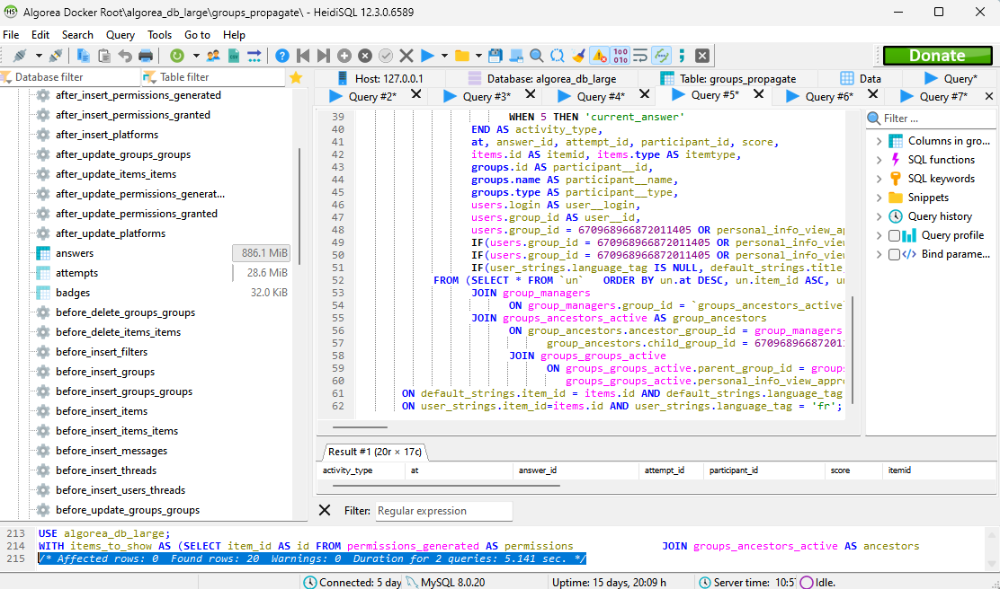

:source-highlighter: highlight.js
= How to optimize a complex SQL query: Mindset and Strategy

You know those crazy SQL queries. I recently optimized one of them for the project https://github.com/France-ioi/AlgoreaBackend[Algorea,window=_blank].

A service of the API was very slow and I've been asked if I can fix it.

I'll describe here the process I took to do that. Along with the mindset I use when I'm facing such challenges.

I believe that the mindset is the most important part.
It's the secret that makes you better and motivated on the long run.

== Replicate the slow execution time

First, you need to replicate. Don't work without seeing the issue.

This might mean loading a lot of data in your database.

Do not proceed to the next step until you see the slow execution time.

== Find the culprit

Once you see the slow execution time, you need to find the cause.

Here, the cause is a slow SQL query. But in real life, it could also come from the code, the network, or anything.

You need to have a way to time-debug your code. Avoid hacking your way in to do that.
An easy way to debug the execution time will save you a lot of time in the long run.
If you don't have it, invest now.

In this case, we have all queries along with their execution time logged in a file.

This is what I found:

----
    [2023-12-12 09:23:47]  [2467.47ms] **complex query here**
----

The complex query is the one I need to optimize. It takes 2.5 seconds to execute.
The whole service takes about the same time to execute, so this is the culprit.

The first thing I do is to copy-paste the query in a SQL editor, and run it to make sure it's as slow as in the logs.

I use HeidiSQL, but you can use any SQL editor you like. As can see at the bottom of the screenshot, the query takes 5 seconds to execute.

We found the culprit!

== Look at the issue the eyes

Now that we have the query, we need to understand it.

I like to say that a formatted code is already half understood. So, let's format it.

I usually use https://codebeautify.org/sqlformatter[CodeBeautify,window=_blank] for that.

This is the result:

[,sql]
----
WITH items_to_show AS (
  SELECT
    item_id AS id
  FROM
    permissions_generated AS permissions
    JOIN groups_ancestors_active AS ancestors ON ancestors.child_group_id = 670968966872011405
    AND ancestors.ancestor_group_id = permissions.group_id
  GROUP BY
    item_id
  HAVING
    (
      MAX(can_view_generated_value) >= 2
    )
    AND (
      MAX(can_watch_generated_value) >= 2
    )
    AND (
      MAX(can_watch_generated_value) >= 2
    )
),
participants AS (
  SELECT
    child_group_id AS id
  FROM
    `groups_ancestors_active`
  WHERE
    (
      ancestor_group_id = 917454091139548680
    )
),
start_from_row AS (
  SELECT
    1
  LIMIT
    1
), un AS (
  SELECT
    *
  FROM
    (
      (
        SELECT
          limited_answers.*,
          gradings.score
        FROM
          (
            SELECT
              STRAIGHT_JOIN
              /* tell the optimizer we don't want to convert IN(...) into JOIN */
              CASE answers.type WHEN 'Submission' THEN 2 WHEN 'Saved' THEN 4 WHEN 'Current' THEN 5 END AS activity_type_int,
              answers.created_at AS at,
              answers.id AS answer_id,
              answers.attempt_id,
              answers.participant_id,
              answers.item_id,
              author_id AS user_id
            FROM
              `answers`
            WHERE
              (
                answers.participant_id IN (
                  SELECT
                    id
                  FROM
                    participants
                )
              )
              AND (
                answers.item_id IN (
                  SELECT
                    id
                  FROM
                    items_to_show
                )
              )
              AND (answers.created_at <= NOW())
              AND (
                answers.participant_id <= (
                  SELECT
                    MAX(id)
                  FROM
                    participants
                )
              )
              AND (
                answers.participant_id >= (
                  SELECT
                    MIN(id)
                  FROM
                    participants
                )
              )
              AND (
                answers.item_id <= (
                  SELECT
                    MAX(id)
                  FROM
                    items_to_show
                )
              )
              AND (
                answers.item_id >= (
                  SELECT
                    MIN(id)
                  FROM
                    items_to_show
                )
              )
            ORDER BY
              answers.created_at DESC,
              answers.item_id ASC,
              answers.participant_id ASC,
              answers.attempt_id DESC,
              CASE answers.type WHEN 'Submission' THEN 2 WHEN 'Saved' THEN 4 WHEN 'Current' THEN 5 END DESC,
              answers.id ASC
            LIMIT
              20
          ) AS limited_answers
          LEFT JOIN gradings ON gradings.answer_id = limited_answers.answer_id
      )
      UNION ALL
        (
          SELECT
            STRAIGHT_JOIN
            /* tell the optimizer we don't want to convert IN(...) into JOIN */
            1 AS activity_type_int,
            started_at AS at,
            -1 AS answer_id,
            started_results.attempt_id,
            started_results.participant_id,
            started_results.item_id,
            started_results.participant_id AS user_id,
            NULL AS score
          FROM
            results AS started_results
          WHERE
            (
              started_results.item_id <= (
                SELECT
                  MAX(id)
                FROM
                  items_to_show
              )
            )
            AND (
              started_results.item_id >= (
                SELECT
                  MIN(id)
                FROM
                  items_to_show
              )
            )
            AND (
              started_results.item_id IN (
                SELECT
                  id
                FROM
                  items_to_show
              )
            )
            AND (
              started_results.started_at <= NOW()
            )
            AND (
              started_results.participant_id <= (
                SELECT
                  MAX(id)
                FROM
                  participants
              )
            )
            AND (
              started_results.participant_id >= (
                SELECT
                  MIN(id)
                FROM
                  participants
              )
            )
            AND (
              started_results.participant_id IN (
                SELECT
                  id
                FROM
                  participants
              )
            )
          ORDER BY
            started_results.started_at DESC,
            started_results.item_id ASC,
            started_results.participant_id ASC,
            started_results.attempt_id DESC
          LIMIT
            20
        )
      UNION ALL
        (
          SELECT
            STRAIGHT_JOIN
            /* tell the optimizer we don't want to convert IN(...) into JOIN */
            3 AS activity_type_int,
            validated_results.validated_at AS at,
            -1 AS answer_id,
            validated_results.attempt_id,
            validated_results.participant_id,
            validated_results.item_id,
            validated_results.participant_id AS user_id,
            NULL AS score
          FROM
            results AS validated_results
          WHERE
            (
              validated_results.item_id IN (
                SELECT
                  id
                FROM
                  items_to_show
              )
            )
            AND (
              validated_results.validated_at <= NOW()
            )
            AND (
              validated_results.participant_id IN (
                SELECT
                  id
                FROM
                  participants
              )
            )
          ORDER BY
            validated_results.validated_at DESC,
            validated_results.item_id ASC,
            validated_results.participant_id ASC,
            validated_results.attempt_id DESC
          LIMIT
            20
        )
    ) AS un
)
SELECT
  STRAIGHT_JOIN CASE activity_type_int WHEN 1 THEN 'result_started' WHEN 2 THEN 'submission' WHEN 3 THEN 'result_validated' WHEN 4 THEN 'saved_answer' WHEN 5 THEN 'current_answer' END AS activity_type,
  at,
  answer_id,
  attempt_id,
  participant_id,
  score,
  items.id AS itemid,
  items.type AS itemtype,
  groups.id AS participant__id,
  groups.name AS participant__name,
  groups.type AS participant__type,
  users.login AS user__login,
  users.group_id AS user__id,
  users.group_id = 670968966872011405
  OR personal_info_view_approvals.approved AS user__show_personal_info,
  IF(
    users.group_id = 670968966872011405
    OR personal_info_view_approvals.approved,
    users.first_name,
    NULL
  ) AS user__first_name,
  IF(
    users.group_id = 670968966872011405
    OR personal_info_view_approvals.approved,
    users.last_name,
    NULL
  ) AS user__last_name,
  IF(
    user_strings.language_tag IS NULL,
    default_strings.title, user_strings.title
  ) AS itemstringtitle
FROM
  (
    SELECT
      *
    FROM
      `un`
    ORDER BY
      un.at DESC,
      un.item_id ASC,
      un.participant_id ASC,
      un.attempt_id DESC,
      un.activity_type_int DESC,
      un.answer_id ASC
    LIMIT
      20
  ) AS activities
  JOIN items ON items.id = item_id
  JOIN `groups` ON groups.id = participant_id
  LEFT JOIN users ON users.group_id = user_id
  LEFT JOIN LATERAL (
    SELECT
      1 AS approved
    FROM
      `groups_ancestors_active`
      JOIN group_managers ON group_managers.group_id = `groups_ancestors_active`.ancestor_group_id
      JOIN groups_ancestors_active AS group_ancestors ON group_ancestors.ancestor_group_id = group_managers.manager_id
      AND group_ancestors.child_group_id = 670968966872011405
      JOIN groups_groups_active ON groups_groups_active.parent_group_id = groups_ancestors_active.child_group_id
      AND groups_groups_active.personal_info_view_approved
    WHERE
      (
        groups_groups_active.child_group_id = users.group_id
      )
    LIMIT
      1
  ) AS personal_info_view_approvals ON 1
  LEFT JOIN items_strings default_strings ON default_strings.item_id = items.id
  AND default_strings.language_tag = items.default_language_tag
  LEFT JOIN items_strings user_strings ON user_strings.item_id = items.id
  AND user_strings.language_tag = 'fr' [2023 - 12 - 12 09 : 23 : 44] [744.81ms] WITH items_to_show AS (
    SELECT
      item_id AS id
    FROM
      permissions_generated AS permissions
      JOIN groups_ancestors_active AS ancestors ON ancestors.child_group_id = 670968966872011405
      AND ancestors.ancestor_group_id = permissions.group_id
    GROUP BY
      item_id
    HAVING
      (
        MAX(can_view_generated_value) >= 2
      )
      AND (
        MAX(can_watch_generated_value) >= 2
      )
      AND (
        MAX(can_watch_generated_value) >= 2
      )
  ),
  participants AS (
    SELECT
      child_group_id AS id
    FROM
      `groups_ancestors_active`
    WHERE
      (
        ancestor_group_id = 917454091139548680
      )
  )
SELECT
  COUNT(*) AS cnt
FROM
  answers
WHERE
  (
    answers.item_id IN (
      SELECT
        id
      FROM
        items_to_show
    )
  )
  AND (
    answers.participant_id IN (
      SELECT
        id
      FROM
        participants
    )
  )
----

Now is the key moment. ** Do not panic! **

== Get your mindset right!

It's easy to get overwhelmed by complex queries, or any complex software engineering issue.

In those cases, I like to remind myself of the following:

- How long it'll take doesn't matter. It'll take as long as it takes. You can't go faster than the process.

- If I feel stress in my body, or any kind of urgency, I stop and take the time to relax first.

- The only way to get better is to do scary things. So I'm grateful for the opportunity to learn something new.

- It would be okay to fail, but only after having tried everything I could.

- I can only progress one step at a time. First, let's understand the issue.

== Understand

A common mistake is to jump right into the problem, without understanding it first.

You might think it saves time, but it's actually the opposite.

I cannot count the number of times I've been stuck on a problem for hours,
then solved it in 5 minutes after taking a step back to understand the whole context.

=== Understand the context

In this case, it's part of a history API. It's used to display the history of group of users.

This history is composed of 5 types of activities.

The result is paginated, fetching 20 activities at a time.

=== Understand the query

Before digging into the details, I like to understand the general structure of the query.

At a first glance, we can see that:
- there are 3 CTEs (items_to_show, participants, start_from_row)
- there is a big UNION ALL with 3 SELECT

The context helps us to understand that the 3 SELECT that are union together are used to fetch the different types of activities in one query.

Of course, we can ask ourselves if this is the best way to do it. But that's not the point here.

Now we use EXPLAIN to get more information about the query.

[,json]
----
    EXPLAIN # The query...
----

Here's the interesting part in the result:

[,json]
----
{
	"table": "permissions_generated",
	"rows":
	[
		{
			"id": 5,
			"select_type": "DERIVED",
			"table": "answers",
			"partitions": null,
			"type": "ALL",
			"possible_keys": "fk_answers_participant_id_attempt_id_item_id_results",
			"key": null,
			"key_len": null,
			"ref": null,
			"rows": 2356760,
			"filtered": 1.85,
			"Extra": "Using where; Using filesort"
		}
	]
}
----

We can see that the query is using *filesort*, on more than 2 million rows. This is probably the cause of the slowness.

=== Narrow down the origin of the problem

Since the query is composed of 3 sub queries, we can easily test manually each of them.

By testing we find that the first sub query is taking almost all the time:

[,sql]
----
SELECT
  limited_answers.*,
  gradings.score
FROM
  (
    SELECT
      STRAIGHT_JOIN
      /* tell the optimizer we don't want to convert IN(...) into JOIN */
      CASE answers.type WHEN 'Submission' THEN 2 WHEN 'Saved' THEN 4 WHEN 'Current' THEN 5 END AS activity_type_int,
      answers.created_at AS at,
      answers.id AS answer_id,
      answers.attempt_id,
      answers.participant_id,
      answers.item_id,
      author_id AS user_id
    FROM
      `answers`
    WHERE
      (
        answers.participant_id IN (
          SELECT
            id
          FROM
            participants
        )
      )
      AND (
        answers.item_id IN (
          SELECT
            id
          FROM
            items_to_show
        )
      )
      AND (answers.created_at <= NOW())
      AND (
        answers.participant_id <= (
          SELECT
            MAX(id)
          FROM
            participants
        )
      )
      AND (
        answers.participant_id >= (
          SELECT
            MIN(id)
          FROM
            participants
        )
      )
      AND (
        answers.item_id <= (
          SELECT
            MAX(id)
          FROM
            items_to_show
        )
      )
      AND (
        answers.item_id >= (
          SELECT
            MIN(id)
          FROM
            items_to_show
        )
      )
    ORDER BY
      answers.created_at DESC,
      answers.item_id ASC,
      answers.participant_id ASC,
      answers.attempt_id DESC,
      CASE answers.type WHEN 'Submission' THEN 2 WHEN 'Saved' THEN 4 WHEN 'Current' THEN 5 END DESC,
      answers.id ASC
    LIMIT
      20
  ) AS limited_answers
  LEFT JOIN gradings ON gradings.answer_id = limited_answers.answer_id
----

By narrowing down even further, we find that the problem is coming from the ORDER BY clause.
This is exactly what we saw in the EXPLAIN result.

Here's some interesting questions to ask yourself at this point:

- Do we really need to sort the results? In this case, we want to see the most recent activities first. So yes.

- Why's the ORDER BY so complex? Can we simplify it?

The problem is that we cannot create an index with the CASE...WHEN...END statement.

Fortunately, it can be removed because it's not actually used.
It is merely used as a tie breaker, for the results to be deterministic.

We can continue to sort by answers.type to keep the tie-breaker, but the actual order doesn't matter.
It seems that the statement was either copied or is coming from a previous version of the query.

== Fix the issue

We update the query by removing the CASE...WHEN...END statement.

Then, we create an index on the columns used in the ORDER BY clause.

[,sql]
----
ALTER TABLE `answers` ADD INDEX `c_at_desc_item_id_part_id_attempt_id_desc_type_desc_answers`
	(`created_at` DESC,`item_id`,`participant_id`,`attempt_id` DESC, `type` DESC, id)
;
----

We finally check the query again, to make sure it's using the index.

Result: the query is now executed almost instantly.

== Check for potential other issues before calling it done

Will the other parts of the query pose a problem in the future?

Here, we can see that the other parts of the query are already using an index. So they should be fine.

This can be seen in the full result of EXPLAIN.

=== Conclusion

We've seen that in order to optimize a complex SQL query, we need to:

1. Replicate the slow execution time
2. Find the query causing the issue
3. Get your mindset right!
4. Understand the context and the issue
5. Narrow down the origin of the problem
6. Fix the issue and test it works
7. Make sure there are no other issues

I hope this will help you in your future optimizations!

If you have any questions, feel free to ask in the comments below.

If you have a better way to do it, I'd love to hear it too!

If your company is struggling with performance issues, I might be able to help you. You can link:/articles/about-me#contact[contact me] to discuss it.

Thank you for reading!

_Photo by link:https://unsplash.com/@sifat_niloy?utm_content=creditCopyText&utm_medium=referral&utm_source=unsplash[Sifat Niloy,window=_blank,opts=nofollow] on link:https://unsplash.com/photos/a-circular-stained-glass-window-in-a-building-2OsgcS-135s?utm_content=creditCopyText&utm_medium=referral&utm_source=unsplash[Unsplash,window=_blank,opts=nofollow]_
